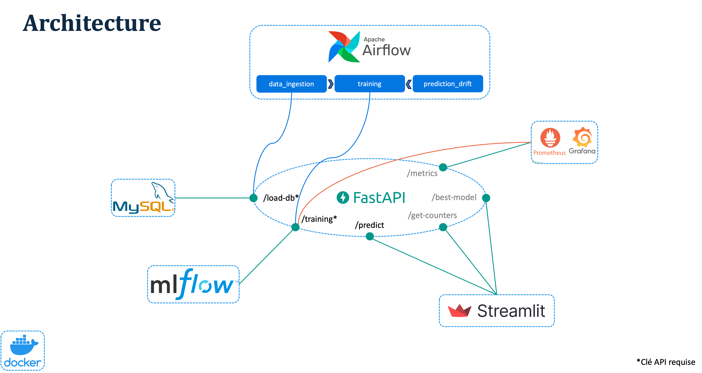

# Vélo Paris

Ce projet déploie, dans le cadre d'un capstone en trois parties chez Liora, un système MLOps qui prédit pour une heure donnée le trafic cycliste sur une soixantaine de sites à Paris. Les données d'entraînement sont les comptages horaires du trafic passé, fournis par la Ville de Paris dans le cadre de son objectif de rendre la capitale 100% cyclable. Le système s'appuie sur plusieurs composants qui, ensemble, en font un pipeline automatisé et auto-réparant.

## Modèles

- Régression Linéaire
- Random Forest
- LightGBM
- XGBoost.

## Stack technique

- Gestion des dépendances : Poetry (Python 3.12.3)
- Conteneurisation : Docker Compose
- Base de données : MySQL (SQLAlchemy/PyMySQL)
- API : FastAPI
- Machine learning : scikit-learn, LightGBM, XGBoost
- Suivi d'expériences et registre de modèles : MLflow
- Orchestration : Airflow
- Détection de drift : Evidently (DataDriftPreset)
- Supervision : Prometheus (prometheus_client) et Grafana
- Frontend : Streamlit

## Architecture

Au cœur de l'architecture se trouve FastAPI qui expose trois endpoints principaux :

- /load-db : extrait les données brutes (CSV le plus récent dans data/raw/), les transforme, et les charge dans la table MySQL training_data. Cette dernière grandit à chaque ingestion plutôt que d'être remplacée. La déduplication repose sur un seuil de date : les lignes ne sont ajoutées que si elles sont postérieures à la date maximale actuelle dans la table.
- /training : entraîne un modèle donné à partir des données MySQL et enregistre dans MLflow ses paramètres, ses métriques de performance, ainsi que l'intervalle des comptages utilisés pour l'entraînement, avant de promouvoir la meilleure version en production dans le Model Registry.
- /predict : recherche la meilleure version d'un modèle et retourne une prédiction. C'est cet endpoint que Streamlit utilise côté utilisateur. Chaque requête de l'utilisateur est également enregistrée dans MySQL (table predictions), ce qui permet la détection de la dérive côté prédiction.

Les routes /load-db et /training sont sécurisées par une clé API alors que les autres sont publiques car elles n'entraînent pas d'écriture et servent uniquement à la lecture de données non sensibles.

On pourrait faire appel à /load-db et /training indépendamment et directement, via le terminal ou Swagger, mais c'est Airflow, l'orchestrateur, qui fait fonctionner le système de manière fluide.

Il y a trois DAGs distincts : l'ingestion_dag, qui tourne quotidiennement, alimente la base MySQL via /load-db. Lors du premier lancement de l'application, il déclenche directement l'entraînement des quatre modèles via un DAG séparé - training_dag - qui les entraîne via /training dans un ordre séquentiel. Par la suite, à chaque nouvelle donnée ajoutée, ingestion_dag vérifie avec Evidently s'il y a une dérive par rapport au contenu de la table training_data. Si un drift est détecté, il relance training_dag, sinon rien ne se passe. Un troisième DAG - prediction_drift_dag - qui tourne également quotidiennement, analyse les requêtes de prédiction stockées dans MySQL et vérifie, une fois qu'au moins 50 prédictions non vérifiées se sont accumulées, si les features saisies présentent un drift par rapport aux données d'entraînement. Le même principe s'applique : en cas de drift, training_dag est relancé, sinon rien ne se passe.

Tandis que le drift est suivi et géré au sein d'Airflow, la santé de l'API elle-même est surveillée par Prometheus, via les métriques collectées par l'endpoint /metrics de FastAPI et affichées sur un dashboard Grafana. Les indicateurs suivis incluent le volume des requêtes, la latence, et le taux d'erreur. Chacun des quatre modèles dispose de sa propre règle d'alerte, utilisant la différence entre max_over_time et min_over_time sur une fenêtre de trois minutes, avec un seuil de trois requêtes en échec. Si ce seuil est dépassé, l'entraînement est relancé directement via un webhook vers /training.

## Note sur la reproductibilité des entraînements

Le découpage entre les jeux d'entraînement et de test respecte des frontières horaires nettes, sans chevauchement entre les deux. Cela permet de reconstruire, à partir de MySQL, le même jeu de données utilisé lors d'un entraînement donné, en filtrant sur l'intervalle de comptages enregistré dans MLflow. Il faut toutefois réappliquer les mêmes conditions dropna() que celles utilisées au moment de l'entraînement, pour obtenir un jeu de données rigoureusement identique.

## Démarrage

### 1. Prérequis

Docker et Docker Compose sont nécessaires. Python 3.12.3 (via pyenv, recommandé) est utile si vous exécutez des scripts hors des conteneurs. Poetry est utilisé pour la gestion des dépendances en local.

### 2. Configuration de l'environnement

Copier le fichier d'exemple et renseigner les vraies valeurs :

cp .env.example .env

Les variables requises incluent MYSQL_PASSWORD, MYSQL_DB et API_KEY.

MYSQL_PASSWORD : l'image MySQL officielle l'utilise pour initialiser l'utilisateur root et la base au premier démarrage, sur un volume vide. N'importe quelle valeur fonctionne, tant qu'elle reste identique entre les services mysql et api (les deux lisent le même fichier .env). Attention : si le volume MySQL contient déjà des données, changer cette valeur plus tard n'a aucun effet, car MySQL conserve le mot de passe de son initialisation d'origine, ce qui provoque des échecs de connexion silencieux. Pour le changer réellement, il faut d'abord supprimer le volume MySQL, ce qui efface les données accumulées.

API_KEY protège les endpoints /load-db et /training (header X-API-Key) et est également utilisée par les contact points webhook de Grafana pour déclencher le réentraînement.

### 3. Amorçage des données brutes

Avant le premier appel à /load-db, le pipeline a besoin d'un CSV brut déjà présent. Télécharger le dernier export depuis Paris Data (opendata.paris.fr), jeu de données des compteurs vélo, puis l'enregistrer dans data/raw/ en respectant la convention de nommage comptage-velo-donnees-compteurs-DD.MM.YYYY.csv, où la date correspond à la date d'observation la plus récente de cet export.

ingest.py scanne data/raw/ et sélectionne automatiquement le fichier le plus récent par date analysée. Relancer l'ingestion plus tard avec un nouvel export ne nécessite donc que de déposer le nouveau CSV dans ce dossier.

### 4. Démarrer la stack

docker compose up -d --build

Le service airflow-init exécute airflow db migrate et crée l'utilisateur admin avant le démarrage du webserver et du scheduler Airflow. Tous les services disposent d'un healthcheck, donc docker compose up attend correctement les dépendances.

### 5. Désactiver la pause des DAGs Airflow

Les trois DAGs démarrent en pause par conception, afin que toute personne clonant le dépôt inspecte le pipeline avant qu'il ne commence à tourner dans son environnement, plutôt qu'il ne se déclenche automatiquement au docker compose up.

- docker compose exec airflow airflow dags unpause training_dag
- docker compose exec airflow airflow dags unpause ingestion_dag
- docker compose exec airflow airflow dags unpause prediction_drift_dag

Attention : si training_dag reste en pause, les appels TriggerDagRunOperator provenant de ingestion_dag ou de prediction_drift_dag se mettront en file d'attente silencieusement et ne s'exécuteront jamais, sans qu'aucune erreur ne soit levée. Il faut toujours désactiver la pause des trois DAGs.

### 6. Accéder aux services

- Interface Airflow : http://localhost:8081
- Documentation FastAPI : http://localhost:8000/docs
- Interface MLflow : http://localhost:5001
- Prometheus : http://localhost:9090
- Grafana : http://localhost:3000
- Interface Streamlit : http://localhost:8501

Ajuster les ports ci-dessus si votre docker-compose.yml les mappe différemment.

Voir API_COMMANDS.pdf pour la liste complète des endpoints de l'API avec des exemples de requêtes.

## Limites connues et améliorations

Deux améliorations sont prévues pour l'ensemble de référence du drift. La première consisterait à fixer la référence sur le train_end_date propre à chaque modèle en production, tel que loggé dans MLflow, plutôt que sur un pool qui grandit indéfiniment. La seconde consisterait à utiliser une fenêtre glissante pour que la taille de l'échantillon, et donc la sensibilité statistique, reste stable dans le temps. Quand la référence grandit sans limite, les tests KS et chi-carré deviennent plus sensibles au bruit, pas moins, car le même écart proportionnel est bien plus significatif sur un million d'échantillons que sur dix. Cela peut à terme produire de faux positifs de drift plutôt que manquer un vrai drift.

## Auteur

Chinnawat Wisetwongsa. Capstone Liora, Projet 3. Superviseur : Nicolas Fradin.
