# Trafic cycliste à Paris

La Ville de Paris met à disposition des données sur le trafic cycliste, collectées grâce à des compteurs répartis dans toute la ville.

L’objectif de ce projet est d’analyser ces données afin d’évaluer l’évolution de la pratique du vélo à Paris et d’aider la mairie à identifier des pistes d’amélioration pour les infrastructures et les politiques cyclables.

## Présentation des données

Les données utilisées dans ce projet sont disponibles sur le site Paris Data (opendata.paris.fr). L’extraction couvre la période du 01/05/2024 au 15/06/2025 et contient plusieurs colonnes, décrites plus en détail dans la [description des colonnes](reports/Description-colonnes.pdf).

| Identifiant du compteur   | Nom du compteur                    |   Identifiant du site de comptage | Nom du site de comptage      |   Comptage horaire | Date et heure de comptage   | Date d'installation du site de comptage   | Lien vers photo du site de comptage                                                                                                         | Coordonnées géographiques   | Identifiant technique compteur   | ID Photos                                                                                                                                                                                                                                                                                                                                                                                                                                                                                                                                                                                                                                                                                                                                                                                                                                                                                                                                                                                   | test_lien_vers_photos_du_site_de_comptage_                                                                                                  | id_photo_1   | url_sites                                  | type_dimage   | mois_annee_comptage   |
|:--------------------------|:-----------------------------------|----------------------------------:|:-----------------------------|-------------------:|:----------------------------|:------------------------------------------|:--------------------------------------------------------------------------------------------------------------------------------------------|:----------------------------|:---------------------------------|:--------------------------------------------------------------------------------------------------------------------------------------------------------------------------------------------------------------------------------------------------------------------------------------------------------------------------------------------------------------------------------------------------------------------------------------------------------------------------------------------------------------------------------------------------------------------------------------------------------------------------------------------------------------------------------------------------------------------------------------------------------------------------------------------------------------------------------------------------------------------------------------------------------------------------------------------------------------------------------------------|:--------------------------------------------------------------------------------------------------------------------------------------------|:-------------|:-------------------------------------------|:--------------|:----------------------|
| 100003098-101003098       | 106 avenue Denfert Rochereau NE-SO |                       1.00003e+08 | 106 avenue Denfert Rochereau |                  0 | 2024-05-01T05:00:00+02:00   | 2012-02-22                                | https://filer.eco-counter-tools.com/file/09/73f38aaf49fa85ee19ee67277787a24af6b31b497e0fbf06bf2970b4449a0409/Y2H16029278_20200818121425.jpg | 48.83507,2.33305            | Y2H20114504                      | https://filer.eco-counter-tools.com/file/09/73f38aaf49fa85ee19ee67277787a24af6b31b497e0fbf06bf2970b4449a0409/Y2H16029278_20200818121425.jpg/https://filer.eco-counter-tools.com/file/1e/766b4ae7bba5ee2e4e87b5ed3990964e393647406bf7169c7b948612c014911e/15977456895210.jpg/https://filer.eco-counter-tools.com/file/96/cf95805b6c2fba4a722174ed6d93acf65a2503bbf41ad417508b20e10ebb6496/Y2H16029278_20220803102622.jpg/https://filer.eco-counter-tools.com/file/9c/21fe20ab12a64990b0db744ec805262d6ac64fca0800e5dc887432307ffab29c/Y2H21110997_20231031090022.jpg/https://filer.eco-counter-tools.com/file/ad/53597f9018bb78ed4018cccaf73e0d792319673f5297297e72b624b221788cad/13305145395420.jpg/https://filer.eco-counter-tools.com/file/ae/9bc3209eb84338645b0dbe0b578336e0e5e9c0103bb2119f6a4694ae5defa0ae/Y2H20114504_20240611133259.jpg/https://filer.eco-counter-tools.com/file/bd/ae1f16033631d0af335022b99f8d2de3e823a970d8b4ae1cc349b2339a6bd2bd/Y2H16029278_20210810113212.jpg | https://filer.eco-counter-tools.com/file/09/73f38aaf49fa85ee19ee67277787a24af6b31b497e0fbf06bf2970b4449a0409/Y2H16029278_20200818121425.jpg | https:       | https://www.eco-visio.net/Photos/100003098 | jpg           | 2024-05               |
| 100003098-101003098       | 106 avenue Denfert Rochereau NE-SO |                       1.00003e+08 | 106 avenue Denfert Rochereau |                  0 | 2024-05-01T09:00:00+02:00   | 2012-02-22                                | https://filer.eco-counter-tools.com/file/09/73f38aaf49fa85ee19ee67277787a24af6b31b497e0fbf06bf2970b4449a0409/Y2H16029278_20200818121425.jpg | 48.83507,2.33305            | Y2H20114504                      | https://filer.eco-counter-tools.com/file/09/73f38aaf49fa85ee19ee67277787a24af6b31b497e0fbf06bf2970b4449a0409/Y2H16029278_20200818121425.jpg/https://filer.eco-counter-tools.com/file/1e/766b4ae7bba5ee2e4e87b5ed3990964e393647406bf7169c7b948612c014911e/15977456895210.jpg/https://filer.eco-counter-tools.com/file/96/cf95805b6c2fba4a722174ed6d93acf65a2503bbf41ad417508b20e10ebb6496/Y2H16029278_20220803102622.jpg/https://filer.eco-counter-tools.com/file/9c/21fe20ab12a64990b0db744ec805262d6ac64fca0800e5dc887432307ffab29c/Y2H21110997_20231031090022.jpg/https://filer.eco-counter-tools.com/file/ad/53597f9018bb78ed4018cccaf73e0d792319673f5297297e72b624b221788cad/13305145395420.jpg/https://filer.eco-counter-tools.com/file/ae/9bc3209eb84338645b0dbe0b578336e0e5e9c0103bb2119f6a4694ae5defa0ae/Y2H20114504_20240611133259.jpg/https://filer.eco-counter-tools.com/file/bd/ae1f16033631d0af335022b99f8d2de3e823a970d8b4ae1cc349b2339a6bd2bd/Y2H16029278_20210810113212.jpg | https://filer.eco-counter-tools.com/file/09/73f38aaf49fa85ee19ee67277787a24af6b31b497e0fbf06bf2970b4449a0409/Y2H16029278_20200818121425.jpg | https:       | https://www.eco-visio.net/Photos/100003098 | jpg           | 2024-05               |
| 100003098-101003098       | 106 avenue Denfert Rochereau NE-SO |                       1.00003e+08 | 106 avenue Denfert Rochereau |                  0 | 2024-05-01T08:00:00+02:00   | 2012-02-22                                | https://filer.eco-counter-tools.com/file/09/73f38aaf49fa85ee19ee67277787a24af6b31b497e0fbf06bf2970b4449a0409/Y2H16029278_20200818121425.jpg | 48.83507,2.33305            | Y2H20114504                      | https://filer.eco-counter-tools.com/file/09/73f38aaf49fa85ee19ee67277787a24af6b31b497e0fbf06bf2970b4449a0409/Y2H16029278_20200818121425.jpg/https://filer.eco-counter-tools.com/file/1e/766b4ae7bba5ee2e4e87b5ed3990964e393647406bf7169c7b948612c014911e/15977456895210.jpg/https://filer.eco-counter-tools.com/file/96/cf95805b6c2fba4a722174ed6d93acf65a2503bbf41ad417508b20e10ebb6496/Y2H16029278_20220803102622.jpg/https://filer.eco-counter-tools.com/file/9c/21fe20ab12a64990b0db744ec805262d6ac64fca0800e5dc887432307ffab29c/Y2H21110997_20231031090022.jpg/https://filer.eco-counter-tools.com/file/ad/53597f9018bb78ed4018cccaf73e0d792319673f5297297e72b624b221788cad/13305145395420.jpg/https://filer.eco-counter-tools.com/file/ae/9bc3209eb84338645b0dbe0b578336e0e5e9c0103bb2119f6a4694ae5defa0ae/Y2H20114504_20240611133259.jpg/https://filer.eco-counter-tools.com/file/bd/ae1f16033631d0af335022b99f8d2de3e823a970d8b4ae1cc349b2339a6bd2bd/Y2H16029278_20210810113212.jpg | https://filer.eco-counter-tools.com/file/09/73f38aaf49fa85ee19ee67277787a24af6b31b497e0fbf06bf2970b4449a0409/Y2H16029278_20200818121425.jpg | https:       | https://www.eco-visio.net/Photos/100003098 | jpg           | 2024-05               |
| 100003098-101003098       | 106 avenue Denfert Rochereau NE-SO |                       1.00003e+08 | 106 avenue Denfert Rochereau |                  0 | 2024-05-01T06:00:00+02:00   | 2012-02-22                                | https://filer.eco-counter-tools.com/file/09/73f38aaf49fa85ee19ee67277787a24af6b31b497e0fbf06bf2970b4449a0409/Y2H16029278_20200818121425.jpg | 48.83507,2.33305            | Y2H20114504                      | https://filer.eco-counter-tools.com/file/09/73f38aaf49fa85ee19ee67277787a24af6b31b497e0fbf06bf2970b4449a0409/Y2H16029278_20200818121425.jpg/https://filer.eco-counter-tools.com/file/1e/766b4ae7bba5ee2e4e87b5ed3990964e393647406bf7169c7b948612c014911e/15977456895210.jpg/https://filer.eco-counter-tools.com/file/96/cf95805b6c2fba4a722174ed6d93acf65a2503bbf41ad417508b20e10ebb6496/Y2H16029278_20220803102622.jpg/https://filer.eco-counter-tools.com/file/9c/21fe20ab12a64990b0db744ec805262d6ac64fca0800e5dc887432307ffab29c/Y2H21110997_20231031090022.jpg/https://filer.eco-counter-tools.com/file/ad/53597f9018bb78ed4018cccaf73e0d792319673f5297297e72b624b221788cad/13305145395420.jpg/https://filer.eco-counter-tools.com/file/ae/9bc3209eb84338645b0dbe0b578336e0e5e9c0103bb2119f6a4694ae5defa0ae/Y2H20114504_20240611133259.jpg/https://filer.eco-counter-tools.com/file/bd/ae1f16033631d0af335022b99f8d2de3e823a970d8b4ae1cc349b2339a6bd2bd/Y2H16029278_20210810113212.jpg | https://filer.eco-counter-tools.com/file/09/73f38aaf49fa85ee19ee67277787a24af6b31b497e0fbf06bf2970b4449a0409/Y2H16029278_20200818121425.jpg | https:       | https://www.eco-visio.net/Photos/100003098 | jpg           | 2024-05               |
| 100003098-101003098       | 106 avenue Denfert Rochereau NE-SO |                       1.00003e+08 | 106 avenue Denfert Rochereau |                  0 | 2024-05-01T14:00:00+02:00   | 2012-02-22                                | https://filer.eco-counter-tools.com/file/09/73f38aaf49fa85ee19ee67277787a24af6b31b497e0fbf06bf2970b4449a0409/Y2H16029278_20200818121425.jpg | 48.83507,2.33305            | Y2H20114504                      | https://filer.eco-counter-tools.com/file/09/73f38aaf49fa85ee19ee67277787a24af6b31b497e0fbf06bf2970b4449a0409/Y2H16029278_20200818121425.jpg/https://filer.eco-counter-tools.com/file/1e/766b4ae7bba5ee2e4e87b5ed3990964e393647406bf7169c7b948612c014911e/15977456895210.jpg/https://filer.eco-counter-tools.com/file/96/cf95805b6c2fba4a722174ed6d93acf65a2503bbf41ad417508b20e10ebb6496/Y2H16029278_20220803102622.jpg/https://filer.eco-counter-tools.com/file/9c/21fe20ab12a64990b0db744ec805262d6ac64fca0800e5dc887432307ffab29c/Y2H21110997_20231031090022.jpg/https://filer.eco-counter-tools.com/file/ad/53597f9018bb78ed4018cccaf73e0d792319673f5297297e72b624b221788cad/13305145395420.jpg/https://filer.eco-counter-tools.com/file/ae/9bc3209eb84338645b0dbe0b578336e0e5e9c0103bb2119f6a4694ae5defa0ae/Y2H20114504_20240611133259.jpg/https://filer.eco-counter-tools.com/file/bd/ae1f16033631d0af335022b99f8d2de3e823a970d8b4ae1cc349b2339a6bd2bd/Y2H16029278_20210810113212.jpg | https://filer.eco-counter-tools.com/file/09/73f38aaf49fa85ee19ee67277787a24af6b31b497e0fbf06bf2970b4449a0409/Y2H16029278_20200818121425.jpg | https:       | https://www.eco-visio.net/Photos/100003098 | jpg           | 2024-05               |

Les principales variables utilisées pour l’analyse sont :
- le nom du site de comptage,
- le comptage horaire,
- la date et l’heure du comptage,
- les coordonnées géographiques.

Le jeu de données contient plus de 947.000 lignes. Chaque ligne correspond au nombre de vélos comptabilisés par un compteur donné sur une heure. Il est important de noter qu’aucune distinction n’est faite entre les vélos observés : un même vélo peut être compté plusieurs fois s’il passe devant plusieurs compteurs au cours d’une même heure.

## Exploration des données

L’exploration des données a permis de mieux comprendre la structure du réseau de compteurs cyclistes à Paris. Le jeu de données contient 108 compteurs uniques, répartis sur 66 sites de comptage. Il est fréquent qu’un même site dispose de deux compteurs, notamment lorsque la voie est à double sens.

Les compteurs n’ont pas tous été installés au même moment et peuvent être temporairement hors service. Toutefois, l’analyse montre que seuls 6 compteurs présentent une couverture inférieure à 80 %, ce qui indique globalement une bonne complétude du jeu de données.

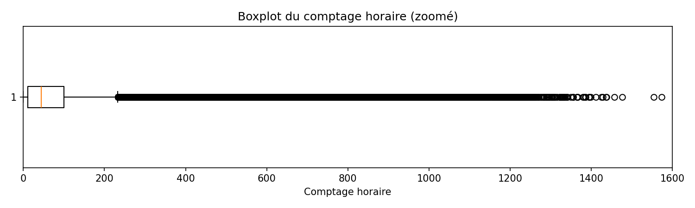

Un point important mis en évidence lors de cette phase concerne la présence d’outliers. D’un point de vue statistique, plus de 74.000 valeurs (environ 8 % des observations) peuvent être considérées comme des valeurs extrêmes, ce qui semble trop élevé pour correspondre uniquement à de véritables anomalies. Faute d’informations supplémentaires, il n’est pas possible de définir précisément à partir de quelle valeur un comptage devient aberrant. Un seuil arbitraire de 1500 vélos par heure a donc été retenu, car une rupture nette apparaît à ce niveau dans la distribution des valeurs.

Enfin, aucun doublon n’a été détecté dans les données. En revanche, certaines valeurs manquantes sont présentes. L’exploration montre que ces valeurs ne sont généralement pas isolées : lorsqu’une donnée est manquante dans une colonne, d’autres colonnes présentent aussi des valeurs absentes. Cela suggère que ces manques sont liés à des problèmes de collecte ou à l’arrêt temporaire de certains compteurs.

## Exploration des données (visualisation)

Les visualisations suivantes permettent d’analyser le trafic cycliste sous deux angles complémentaires : temporel et géographique. Elles offrent une première lecture des dynamiques d’usage du vélo à Paris, à la fois dans le temps et selon les zones de la ville.

### Trafic cycliste journalier

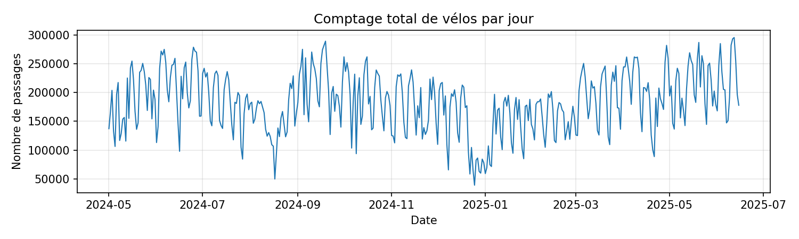

Cette visualisation montre l’évolution du nombre total de passages de vélos par jour sur la période étudiée. On observe une forte variabilité quotidienne, avec des pics marqués et des périodes plus calmes. Ces variations peuvent être liées à des effets saisonniers, météorologiques ou à des événements ponctuels. Il est également important de rappeler que les compteurs n’ont pas tous été installés au même moment et qu’ils peuvent être temporairement hors service, ce qui peut contribuer à certaines variations artificielles dans les données. Enfin, ces valeurs correspondent à des passages comptabilisés par les capteurs et non au nombre réel de cyclistes.

### Trafic cycliste mensuel

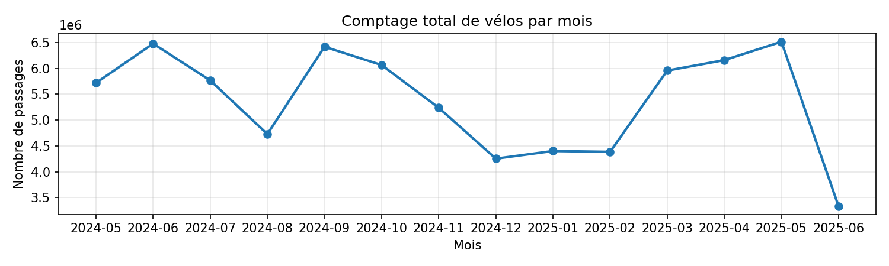

L’agrégation mensuelle permet de lisser les fluctuations journalières et de mieux observer les tendances globales. Ce graphique met en évidence une saisonnalité claire, avec une augmentation du trafic sur certaines périodes de l’année. Cette représentation facilite l’identification des phases de hausse ou de baisse de la pratique du vélo à Paris.

### Moyenne des comptages horaires par jour

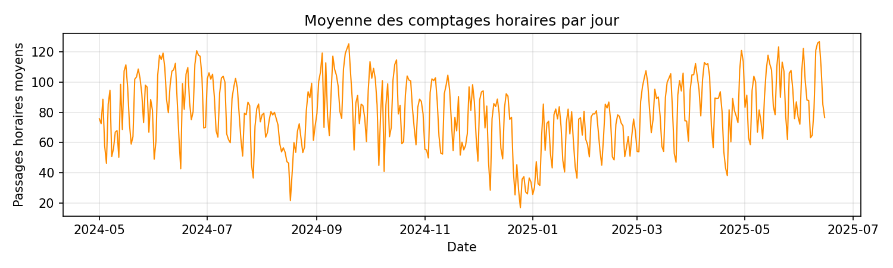

Ce graphique présente, pour chaque jour, la moyenne des comptages horaires par compteur, calculée sur l’ensemble des sites et des heures de la journée. Contrairement au trafic total journalier, cette mesure permet de s’affranchir en partie du nombre de compteurs actifs à un instant donné. Elle donne ainsi une vision plus stable de l’intensité moyenne du trafic cycliste et rend les comparaisons temporelles plus pertinentes, notamment lorsque certains capteurs sont installés plus tard ou temporairement hors service.

### Trafic moyen par heure de la journée

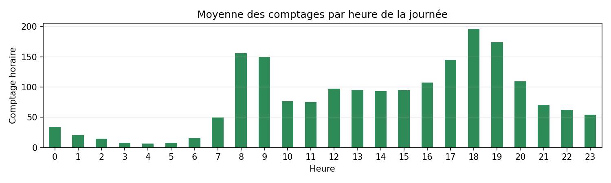

Le graphique horaire met en évidence la répartition du trafic cycliste au cours de la journée. Des pics apparaissent aux heures de pointe, en début de matinée et en fin de journée. Ce comportement est cohérent avec des usages utilitaires du vélo, en complément ou en alternative aux autres modes de transport.

### Trafic moyen par jour de la semaine

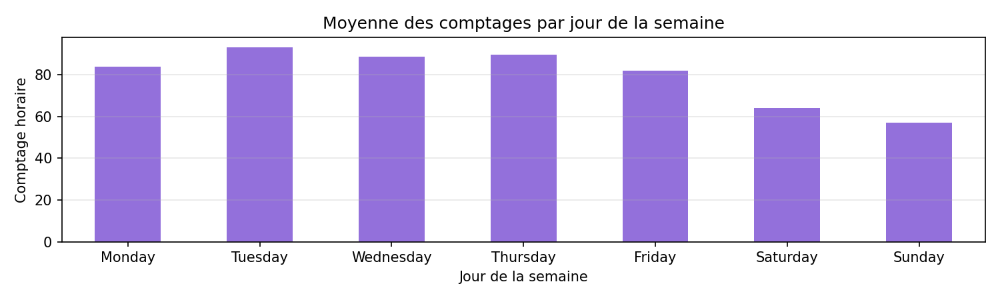

Cette visualisation compare le trafic cycliste moyen selon le jour de la semaine. On observe généralement des différences nettes entre les jours ouvrés et le week-end. Les jours de semaine présentent des niveaux de trafic plus élevés, ce qui suggère un usage important du vélo pour les déplacements quotidiens, notamment domicile-travail.

### Top 10 des sites de comptage – moyenne horaire

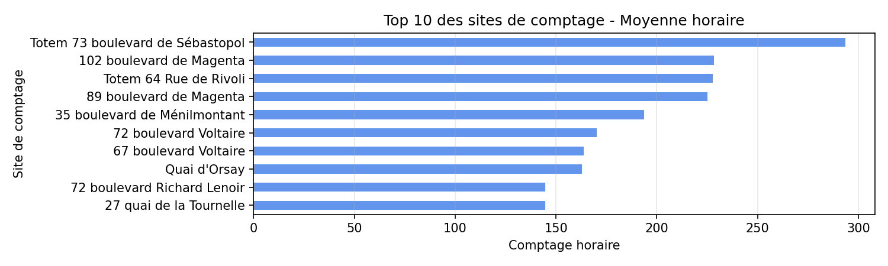

Cette visualisation présente les dix sites de comptage les plus fréquentés, classés selon la moyenne horaire des passages enregistrés. Elle permet d’identifier les zones où l’activité cycliste est la plus intense en moyenne. Toutefois, cette analyse ne prend pas en compte les différences de durée d’installation ou de fonctionnement des capteurs, et doit donc être interprétée avec prudence.

### Comparaison de la moyenne horaire par site (Top 10)

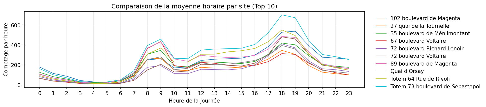

Cette visualisation compare le profil horaire moyen des dix sites de comptage les plus fréquentés. Elle met en évidence des différences d’intensité entre les sites, liées notamment à leur localisation et à leur niveau d’activité. Malgré ces variations, les profils horaires restent très similaires dans leur forme générale : une augmentation progressive en début de matinée, un pic aux heures de pointe, une baisse en milieu de journée, puis une nouvelle hausse en fin d’après-midi.

### Répartition géographique des comptages

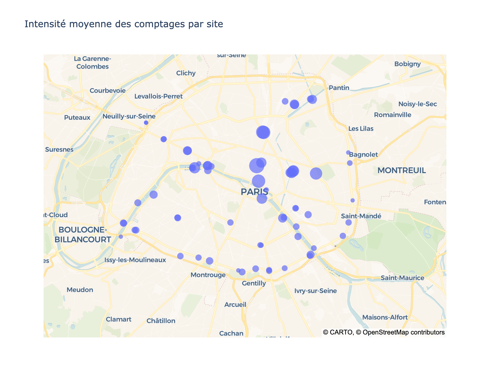

Cette carte permet de visualiser l’intensité moyenne du trafic cycliste selon les sites de comptage. Certaines zones ressortent clairement comme plus fréquentées, souvent situées sur des axes structurants ou dans des quartiers centraux. À l’inverse, d’autres sites présentent des volumes plus faibles, ce qui reflète des usages différents selon les zones de la ville. Enfin, certains arrondissements ne possèdent aucun compteur, ou très peu.

## Prétraitement des données

### Nettoyage du jeu de données

La phase d’exploration des données a permis d’identifier plusieurs points clés et d’orienter le prétraitement du jeu de données afin de le rendre plus complet et plus pertinent pour la phase de modélisation.

Dans un premier temps, les colonnes qui n’avaient pas d’utilité pour la modélisation ou pour l’application Streamlit ont été supprimées. Les valeurs aberrantes ont ensuite été retirées à partir du seuil identifié lors de la phase exploratoire. Une étape de suppression des doublons a également été intégrée, même si aucun doublon n’a été détecté dans le jeu de données initial.

### Traitement des valeurs manquantes

Les valeurs manquantes ont ensuite été traitées en s’appuyant sur les enseignements de l’exploration. Lorsqu’une information était manquante, elle a pu être complétée soit à partir d’autres colonnes, soit en utilisant des observations similaires pour un même compteur lorsque les données étaient disponibles.

### Enrichissement des variables

La phase de prétraitement a également permis d’enrichir le jeu de données par l’ajout de nouvelles variables, issues à la fois des colonnes existantes et de sources externes. Les coordonnées géographiques ont été séparées en latitude et longitude, et une information de direction a été extraite à partir de la colonne « Nom du compteur ».

Des variables météorologiques ont également été ajoutées, notamment la température ainsi que les quantités de pluie ou de neige, à une granularité horaire couvrant la même période que le jeu de données principal. Ces informations proviennent de l’API Historical Weather.

Plusieurs variables calendaires ont été créées, telles que le jour du mois, le mois, l’année, le jour de la semaine et un indicateur de week-end. Une variable indiquant les périodes de vacances a également été intégrée. Pour cela, un fichier Excel a été construit manuellement afin d’indiquer le statut de vacances pour chaque jour sur les trois dernières années.

### Variables temporelles avancées

Enfin, compte tenu de l’importance de la dimension temporelle mise en évidence lors de l’exploration, des variables basées sur des retards ont été ajoutées (lag-1, lag-24 et lag-168), ainsi qu’une moyenne glissante sur 3 heures.

### Harmonisation des informations par site

La dernière étape du prétraitement consiste à harmoniser certaines informations redondantes, notamment lorsque plusieurs valeurs de coordonnées ou d’images sont associées à un même site de comptage, en conservant une seule version cohérente de ces données.

## Modélisation des données

### Modèles de référence basés sur les lags

Dans un premier temps, des modèles de référence basés sur des retards temporels (lags) ont été mis en place. Ces modèles, souvent qualifiés de méthodes naïves, consistent à prédire le trafic horaire à partir de valeurs passées. Trois configurations ont été testées : un lag-1 (heure précédente), un lag-24 (même heure la veille) et un lag-168 (même heure une semaine plus tôt).

Les performances ont été évaluées à l’aide de la MAE, de la RMSE et du score R², en comparant les valeurs prédites aux valeurs observées. Les résultats montrent une amélioration progressive des performances lorsque le lag augmente. Le modèle lag-1 obtient une MAE de 29.36 et une RMSE de 58.96. En passant au lag-24, les erreurs diminuent (MAE = 25.75 ; RMSE = 54.12), ce qui indique que le trafic à une heure donnée est souvent mieux expliqué par la valeur observée la veille à la même heure. Le modèle lag-168 donne les meilleurs résultats (MAE = 24.02 ; RMSE = 50.73), mettant en évidence une forte saisonnalité hebdomadaire du trafic cycliste.

Les scores de R² confirment cette tendance, en passant de 70.4 % pour le lag-1 à 75.1 % pour le lag-24, puis à 78.2 % pour le lag-168. Plus le lag correspond à un cycle temporel pertinent, journalier puis hebdomadaire, plus le modèle parvient à expliquer la variance des comptages. Ces modèles constituent ainsi un point de référence solide pour l’évaluation de modèles plus complexes.

### Modèles de régression linéaire

Dans un second temps, plusieurs modèles de régression linéaire ont été entraînés : régression linéaire classique, Ridge, Lasso et Elastic Net. Contrairement aux modèles de référence basés uniquement sur les valeurs passées du comptage horaire, ces modèles exploitent l’ensemble des variables explicatives issues du prétraitement (variables temporelles, calendaires et météorologiques).

Les performances obtenues sont très proches pour l’ensemble de ces modèles, ce qui suggère que le modèle linéaire de base capture déjà correctement l’information sans problème majeur de sur-apprentissage.

Ces modèles obtiennent de meilleurs résultats que les modèles à base de lags, mais les scores restent limités (R² de 89.5 %). Comme observé lors de l’exploration, certaines variables n’entretiennent pas de relations strictement linéaires avec le trafic cycliste.

### Modèles non linéaires : Random Forest

Pour cette raison, un modèle de Random Forest a ensuite été entraîné afin de prendre en compte des relations non linéaires entre les variables. Ce type de modèle est bien adapté à ce jeu de données, mais peut être coûteux en temps de calcul et en ressources. Différents paramètres ont donc été testés afin de trouver un bon compromis entre performance et temps d’entraînement. Avec ce modèle, le score R² atteint environ 93 %, ce qui représente une amélioration significative.

### Modèles de gradient boosting

Après Random Forest, deux modèles de gradient boosting ont été entraînés : LightGBM et XGBoost. Ces modèles sont particulièrement adaptés aux données tabulaires et permettent de capturer des relations non linéaires tout en restant performants sur des volumes importants.

Pour LightGBM, les hyperparamètres ont été choisis pour obtenir un modèle robuste sans faire une optimisation exhaustive. Le modèle utilise un nombre relativement élevé d’arbres (n_estimators = 500) avec un learning_rate plus faible, ce qui permet d’apprendre progressivement et de limiter le sur-apprentissage. Les paramètres subsample et colsample_bytree (fixés à 0.8) introduisent de l’aléa (sur les lignes et les colonnes), ce qui améliore la généralisation. Enfin, la limitation de profondeur (max_depth) permet de contrôler la complexité des arbres. L’ensemble constitue un bon compromis entre performance, stabilité et temps de calcul.

Pour XGBoost, une logique similaire a été appliquée afin d’obtenir un modèle comparable à LightGBM. Le couple learning_rate = 0.05 et n_estimators = 500 permet aussi un apprentissage progressif. Les paramètres de sous-échantillonnage (subsample et colsample_bytree) sont également utilisés pour réduire le risque de sur-ajustement. Une régularisation L2 (reg_lambda) est conservée (valeur par défaut), et certains paramètres sont adaptés pour garder un temps d’entraînement raisonnable sur CPU.

Au niveau des performances, les deux modèles donnent des résultats très proches : MAE de 13.52–13.61, RMSE de 23.89-24.09, et R² proche de 96 %. Cela représente un gain net par rapport aux modèles précédents. Les performances étant quasiment équivalentes, LightGBM est retenu dans le cadre de ce projet, car il est plus léger et plus rapide, tout en conservant une excellente précision.

### Interprétation du modèle avec SHAP

À partir du meilleur modèle retenu dans le cadre de ce projet, une analyse SHAP a été réalisée afin d’interpréter l’influence des variables sur les prédictions.

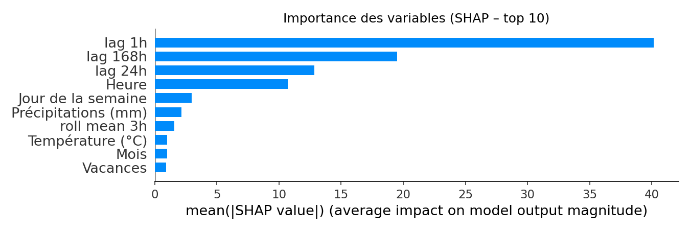

Le graphique d’importance globale des variables (SHAP – top 10) montre l’impact moyen de chaque variable sur les prédictions du modèle, sans tenir compte du sens de l’effet. Il met en évidence la domination des variables de retard, en particulier lag 1h, lag 168h et lag 24h, ce qui confirme que le trafic cycliste est largement expliqué par sa propre dynamique passée. La variable Heure apparaît également parmi les variables les plus importantes, tandis que les variables météorologiques et calendaires présentent une contribution plus limitée à l’échelle globale.

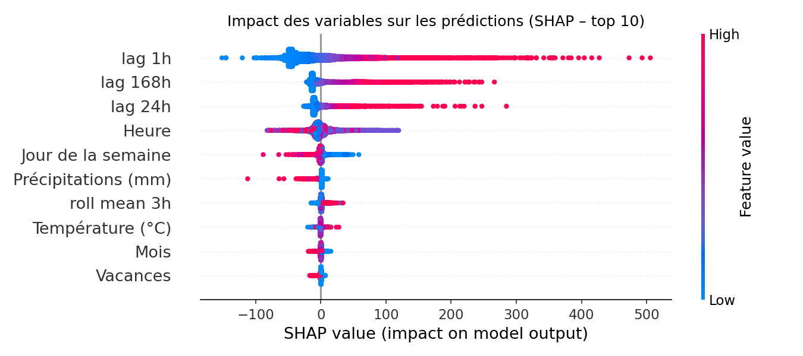

Le graphique de type summary plot complète cette analyse en montrant à la fois l’importance des variables et le sens de leur contribution. On observe que des valeurs élevées des lags sont associées à des contributions SHAP positives, ce qui signifie que le modèle prédit un trafic plus important lorsque le trafic récent ou hebdomadaire est élevé. La variable Heure reflète clairement les cycles journaliers, avec des contributions positives aux heures de pointe et négatives aux heures creuses. Les variables météo et calendaires ont bien un effet, mais celui-ci reste secondaire par rapport aux variables temporelles.

Enfin, les graphiques de dépendance SHAP apportent une lecture plus fine de certaines relations :

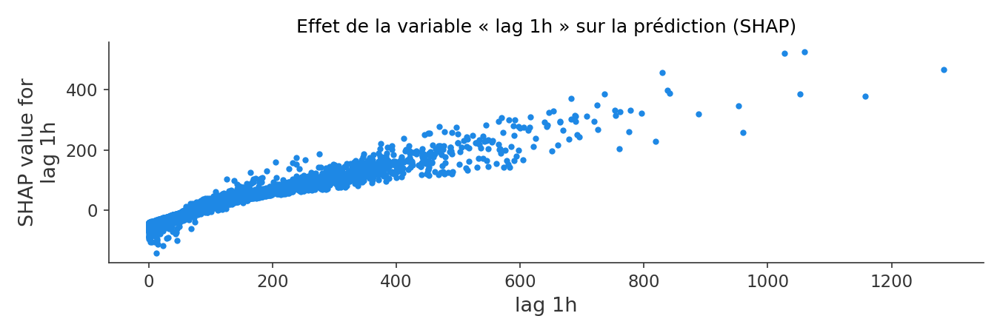

Pour lag 1h, on observe une relation fortement croissante : lorsque le comptage à t−1h augmente, la prédiction augmente également, avec une tendance à la saturation pour les valeurs les plus élevées.

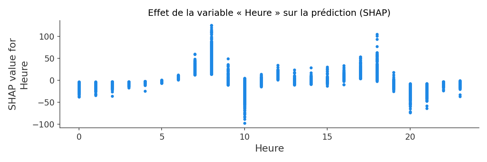

Pour la variable Heure, la relation est non linéaire, avec des effets positifs ou négatifs selon le moment de la journée. La dispersion observée pour une même heure suggère également l’existence d’interactions avec d’autres variables, comme le jour de la semaine ou la météo.

## Conclusion

L’analyse des données de comptage cycliste met en évidence des dynamiques très marquées dans l’usage du vélo à Paris. Le trafic est fortement structuré par le temps, avec des variations claires selon l’heure de la journée, le jour de la semaine et les cycles hebdomadaires. Les heures de pointe ressortent nettement, ce qui confirme un usage important du vélo pour les déplacements quotidiens, notamment domicile-travail.

Les résultats montrent également des différences significatives entre les sites de comptage, certaines zones concentrant une activité cycliste plus intense que d’autres. Malgré ces disparités spatiales, les profils horaires restent globalement similaires d’un site à l’autre, ce qui suggère des comportements de déplacement relativement homogènes à l’échelle de la ville.

Enfin, la modélisation confirme que le trafic cycliste à Paris est avant tout expliqué par sa propre dynamique passée. Les variables temporelles et les lags jouent un rôle central dans la prédiction des comptages, tandis que des facteurs comme la météo ou les vacances ont un impact plus secondaire. Ces observations montrent que les données de comptage constituent un outil pertinent pour suivre et comprendre l’évolution des usages du vélo à Paris.
